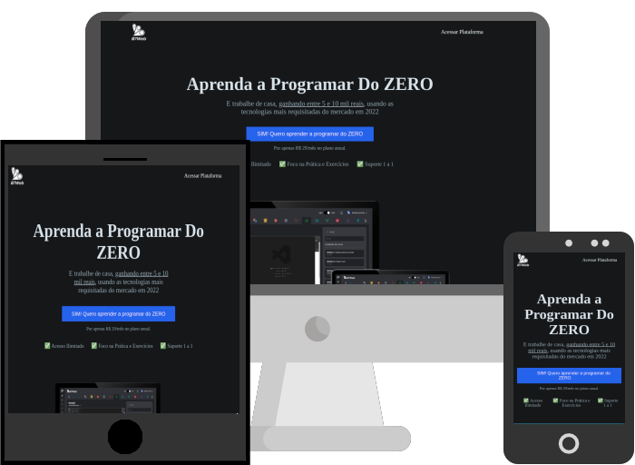

<h1 align="center">Clone da landing page do curso B7Web</h1>

    

<h2>:rocket: Tecnologias Usadas</h2>

  
  
  
  

<h2>:computer: Projeto</h2>

Clone desenvolvido para fins didáticos.   
O intuito foi colocar em prática componentização e compilação usando npm, Sass e Webpack. 
Veja o projeto base [aqui](https://github.com/caiquedv/b7lp_base-project).

<h2>:eyes: Deploy</h2>

Veja o projeto em [GitHub Pages](https://caiquedv.github.io/sass-b7landing-page/).
